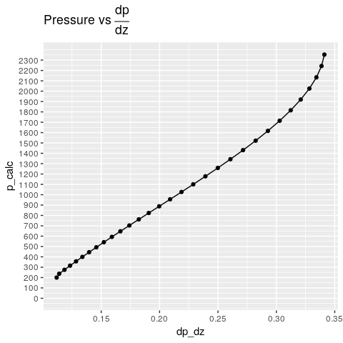
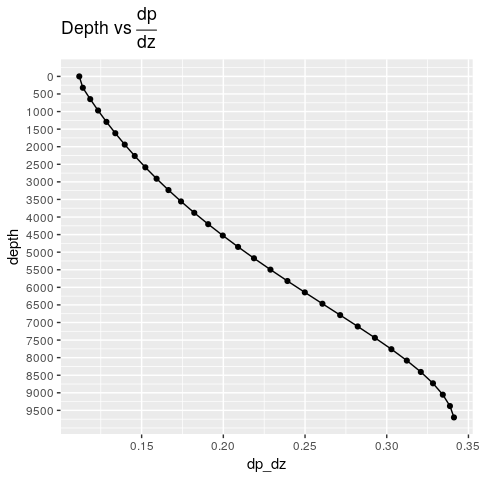

Descending into the bottomhole. A Marching Algorithm for Vertical Lift
Performance in Petroleum Engineering
================

# Introduction

I have always been captivated by calculations performed at depth in
wells. The numerous correlations and curves that were built in the
golden years of production engineering are just fascinating. *Thank you
Mr. Brown. Thank you Mr. Beggs.* From all the various algorithms, I
particularly liked one calculating the pressure losses in the tubing as
the hydrocarbon fluids ascend to the surface, also called tubing
performance, or vertical lift performance (VLP). If you are a petroleum
engineer who just started learning to code, there is no better exercise
than calculating the pressure gradient at any depth point in the
wellbore. It tests your petroleum engineering skills with fluid
properties of oil, gas and water; correlations; multi-phase phenomena;
pressure and temperature effects; heat transfer, etc.

Although, we will not be seeing all the calculations to perform a full
VLP using Hagendorn-Brown, Fancher-Brown, Duns-Ros, or Beggs-Brill
correlations, this article will place you in condition to understand the
whole application when it is publicly released. I will be using R as it
has demonstrated a solid and reliable platform for developing rapid
applications not only for statistics and data science, but also in
engineering and science in general.

# Motivation

For those colleagues that are looking to implement an engineering
library to solve some problems arising during daily operations there is
no better tool than a scripting language, be that
[R](https://www.r-project.org/about.html), or
[Python](https://www.python.org/). There has not been a better time to
switch from Excel and VBA to do quick coding than today with all the
tools provided by the **data science revolution**. Besides revision
control of your work with Git, ease of sharing within your organization,
building rapid prototypes, you are also following one of the key
premises of data science. Actually, what adds the word **science** to
*data science*: **reproducibility**.

The code I am publishing here serves three purposes:

  - Familiarize the petroleum engineer with a fundamental algorithm for
    downhole calculations
  - Learn the basics of scripting with R: vectors, lists, dataframes,
    loops and decision logic. And plotting with one of the best tools in
    data visualization: `ggplot2`.
  - Show the basic structure of more complex iterating algorithms for
    calculating conditions at any depth point in the well.

# Computation Workflow

This is a description of what the code will be doing.

1.  Read the well input data
2.  Set the number of tubing segments
3.  Calculate length of tubing segments
4.  Set the starting calculation increment for the gradient
5.  Set an starting value for the inlet and outlet pressures
6.  Iterate through the number of tubing segments
    1.  Calculate a depth point
    2.  Calculate the outlet pressure at current depth
    3.  Iterate until absolute error is within the defined tolerance
        1.  Calculate the average pressure
        2.  Calculate the fluid properties at P, T
        3.  Calculate the pressure gradient
        4.  Calculate a new outlet pressure
        5.  Compare the absolute error vs the tolerance for the pressure
        6.  If not converging, set inlet pressure to outlet pressure;
            repeat from step `6c`
        7.  Store calculations at depth
    4.  If more tubing segment repeat from step `6`
7.  Make data table

<!-- end list -->

  - Calculating the length of the tubing segments involve dividing the
    well depth () by the
    number of depth points (). In this example `n=30`.

  
  

  - For setting the starting calculation increment for the gradient we
    could assume 0.002 psi/ft:

  
  

  - Calculating the average pressure requires averaging the inlet and
    outlet pressure at the ends of the virtual pipe:

  
} {2}")  

  - Calculating the pressure gradient `-dP/dz`:   
     = f(P_{avg}) ")  
  - Calculating a new pressure

  
_i dL_i ")  

  - Comparing the absolute error of the new pressure and the current
    outlet pressure. It should be less than the tolerance, otherwise, we
    proceed with a new iteration making .

  
  

# Implementation of marching algorithm for well gradient

For demo purposes, only using a dummy function, that will symbolize all
the intricate calculations to find the fluid properties at the current
pressure and temperature. The last thing to do is generating a dataframe
with the calculated data. As a matter of fact, it could be two
dataframes, one for the main results for each pipe segment; and the
second dataframe -with more detail-, showing the iterations and absolute
error.

## Marching algorithm

I have added comments to the code as much as possible to be able to
understand what every line of code is doing. There is no better way of
coding than commenting code. Not only for whoever takes over your
project but also keep in mind that you are documenting for your future
self.

``` r
# load libraries
library(latex2exp)
library(ggplot2)

tolerance = 0.00001      # will be compared against absolute error
thp       = 200          # initial pressure (tubing head pressure)
depth_wh  = 0            # depth at wellhead
depth_bh  = 9700         # depth at bottomhole
segments  = 30           # calculation segments

# rows have to be greater than segments to allocate the zero or initial value
# consider that in length.out parameter in the sequence below
depth   <- seq.int(from = depth_wh, to = depth_bh, length.out = segments+1)
n       <- length(depth)   # depth points same as # rows or (segments+1)

# dummy function that represents a lot of subsurface calculations
fPa <- function(x) 9e-02 + 1e-04 * x + 5e-08  * x^2 - 2e-11 * x^3

depth_top <- depth_wh
dp_dz     <- 0.002                    # 1st approximation of the gradient
p_in      <- thp                      # the initial pressure
output <- vector("list")
for (i in seq_len(n)) {               # n: is the number of depths or # rows
    depth_prev <- ifelse(i == 1, depth_top, depth[i-1])
    dL = depth[i] - depth_prev              # calculate dL
    p_out = p_in + dp_dz * dL               # calculate outlet pressure
    cat(sprintf("i=%2d depth=%8.0f dL=%8.1f segment=%d \n",  # header outer loop
                i, depth[i], dL, i-1))
    cat(sprintf("%8s %6s %6s %8s %8s %8s %10s \n",           # header inner loop
            "iter", "p_in", "p_out", "p_avg", "p_calc", "dp/dz", "eps"))
    epsilon <- 1   # initial values before inner loop
    iter <- 1
    # here we start iterating for the pressure gradient
    while (epsilon > tolerance) {       # loop until AE greater than tolerance
      p_avg <- (p_in + p_out) / 2       # calculate average pressure
      dp_dz <- fPa(p_avg)   # calculate gradient as function of average pressure
      p_calc <- p_in - (-dp_dz) * dL
      epsilon <- abs( (p_out - p_calc) / p_calc )  # absolute error
      cat(sprintf("%8d %6.1f %6.1f %8.2f %8.2f %8.5f %10.8f \n", 
                  iter, p_in, p_out, p_avg, p_calc, dp_dz, epsilon))
      
      if (epsilon >= tolerance) p_out = p_calc # if error too big, iterate again
      iter <- iter + 1                         # with a new pressure
    } # end of while 
    p_in = p_out      # assign p_out to the inlet pressure of new segment, p_in
    output[[i]] <- list(depth = depth[i], p_calc = p_calc,   # values to list
                        p_avg = p_avg, dp_dz = dp_dz)     
} # end-for
#> i= 1 depth=       0 dL=     0.0 segment=0 
#>     iter   p_in  p_out    p_avg   p_calc    dp/dz        eps 
#>        1  200.0  200.0   200.00   200.00  0.11184 0.00000000 
#> i= 2 depth=     323 dL=   323.3 segment=1 
#>     iter   p_in  p_out    p_avg   p_calc    dp/dz        eps 
#>        1  200.0  236.2   218.08   236.85  0.11398 0.00291946 
#>        2  200.0  236.9   218.43   236.87  0.11402 0.00005615 
#>        3  200.0  236.9   218.43   236.87  0.11402 0.00000108 
#> i= 3 depth=     647 dL=   323.3 segment=2 
#>     iter   p_in  p_out    p_avg   p_calc    dp/dz        eps 
#>        1  236.9  273.7   255.30   275.17  0.11846 0.00521195 
#>        2  236.9  275.2   256.02   275.20  0.11854 0.00010249 
#>        3  236.9  275.2   256.03   275.20  0.11855 0.00000202 
#> i= 4 depth=     970 dL=   323.3 segment=3 
#>     iter   p_in  p_out    p_avg   p_calc    dp/dz        eps 
#>        1  275.2  313.5   294.36   315.05  0.12326 0.00483722 
#>        2  275.2  315.0   295.12   315.08  0.12335 0.00009717 
#>        3  275.2  315.1   295.14   315.08  0.12335 0.00000195 
#> i= 5 depth=    1293 dL=   323.3 segment=4 
#>     iter   p_in  p_out    p_avg   p_calc    dp/dz        eps 
#>        1  315.1  355.0   335.02   356.58  0.12836 0.00454033 
#>        2  315.1  356.6   335.83   356.62  0.12846 0.00009306 
#>        3  315.1  356.6   335.85   356.62  0.12847 0.00000191 
#> i= 6 depth=    1617 dL=   323.3 segment=5 
#>     iter   p_in  p_out    p_avg   p_calc    dp/dz        eps 
#>        1  356.6  398.2   377.39   399.87  0.13378 0.00429984 
#>        2  356.6  399.9   378.24   399.91  0.13390 0.00008982 
#>        3  356.6  399.9   378.26   399.91  0.13390 0.00000188 
#> i= 7 depth=    1940 dL=   323.3 segment=6 
#>     iter   p_in  p_out    p_avg   p_calc    dp/dz        eps 
#>        1  399.9  443.2   421.56   445.03  0.13954 0.00410123 
#>        2  399.9  445.0   422.47   445.07  0.13966 0.00008719 
#>        3  399.9  445.1   422.49   445.07  0.13967 0.00000185 
#> i= 8 depth=    2263 dL=   323.3 segment=7 
#>     iter   p_in  p_out    p_avg   p_calc    dp/dz        eps 
#>        1  445.1  490.2   467.65   492.16  0.14565 0.00393422 
#>        2  445.1  492.2   468.61   492.20  0.14578 0.00008501 
#>        3  445.1  492.2   468.64   492.20  0.14579 0.00000184 
#> i= 9 depth=    2587 dL=   323.3 segment=8 
#>     iter   p_in  p_out    p_avg   p_calc    dp/dz        eps 
#>        1  492.2  539.3   515.77   541.39  0.15213 0.00379124 
#>        2  492.2  541.4   516.80   541.44  0.15227 0.00008313 
#>        3  492.2  541.4   516.82   541.44  0.15228 0.00000182 
#> i=10 depth=    2910 dL=   323.3 segment=9 
#>     iter   p_in  p_out    p_avg   p_calc    dp/dz        eps 
#>        1  541.4  590.7   566.06   592.85  0.15900 0.00366651 
#>        2  541.4  592.8   567.14   592.90  0.15915 0.00008144 
#>        3  541.4  592.9   567.17   592.90  0.15915 0.00000181 
#> i=11 depth=    3233 dL=   323.3 segment=10 
#>     iter   p_in  p_out    p_avg   p_calc    dp/dz        eps 
#>        1  592.9  644.4   618.63   646.65  0.16626 0.00355546 
#>        2  592.9  646.7   619.78   646.71  0.16642 0.00007984 
#>        3  592.9  646.7   619.80   646.71  0.16643 0.00000179 
#> i=12 depth=    3557 dL=   323.3 segment=11 
#>     iter   p_in  p_out    p_avg   p_calc    dp/dz        eps 
#>        1  646.7  700.5   673.61   702.95  0.17394 0.00345433 
#>        2  646.7  702.9   674.83   703.00  0.17411 0.00007826 
#>        3  646.7  703.0   674.85   703.00  0.17411 0.00000177 
#> i=13 depth=    3880 dL=   323.3 segment=12 
#>     iter   p_in  p_out    p_avg   p_calc    dp/dz        eps 
#>        1  703.0  759.3   731.15   761.86  0.18203 0.00335992 
#>        2  703.0  761.9   732.43   761.91  0.18221 0.00007661 
#>        3  703.0  761.9   732.46   761.92  0.18221 0.00000175 
#> i=14 depth=    4203 dL=   323.3 segment=13 
#>     iter   p_in  p_out    p_avg   p_calc    dp/dz        eps 
#>        1  761.9  820.8   791.37   823.52  0.19054 0.00326942 
#>        2  761.9  823.5   792.72   823.58  0.19073 0.00007482 
#>        3  761.9  823.6   792.75   823.58  0.19073 0.00000171 
#> i=15 depth=    4527 dL=   323.3 segment=14 
#>     iter   p_in  p_out    p_avg   p_calc    dp/dz        eps 
#>        1  823.6  885.3   854.42   888.08  0.19947 0.00318027 
#>        2  823.6  888.1   855.83   888.14  0.19967 0.00007282 
#>        3  823.6  888.1   855.86   888.14  0.19967 0.00000167 
#> i=16 depth=    4850 dL=   323.3 segment=15 
#>     iter   p_in  p_out    p_avg   p_calc    dp/dz        eps 
#>        1  888.1  952.7   920.42   955.66  0.20881 0.00309004 
#>        2  888.1  955.7   921.90   955.72  0.20901 0.00007053 
#>        3  888.1  955.7   921.93   955.73  0.20902 0.00000161 
#> i=17 depth=    5173 dL=   323.3 segment=16 
#>     iter   p_in  p_out    p_avg   p_calc    dp/dz        eps 
#>        1  955.7 1023.3   989.52  1026.38  0.21853 0.00299644 
#>        2  955.7 1026.4   991.05  1026.45  0.21875 0.00006791 
#>        3  955.7 1026.5   991.09  1026.45  0.21875 0.00000154 
#> i=18 depth=    5497 dL=   323.3 segment=17 
#>     iter   p_in  p_out    p_avg   p_calc    dp/dz        eps 
#>        1 1026.5 1097.2  1061.82  1100.37  0.22861 0.00289723 
#>        2 1026.5 1100.4  1063.41  1100.44  0.22883 0.00006487 
#>        3 1026.5 1100.4  1063.45  1100.44  0.22884 0.00000145 
#> i=19 depth=    5820 dL=   323.3 segment=18 
#>     iter   p_in  p_out    p_avg   p_calc    dp/dz        eps 
#>        1 1100.4 1174.4  1137.44  1177.72  0.23900 0.00279021 
#>        2 1100.4 1177.7  1139.08  1177.79  0.23922 0.00006138 
#>        3 1100.4 1177.8  1139.12  1177.79  0.23923 0.00000135 
#> i=20 depth=    6143 dL=   323.3 segment=19 
#>     iter   p_in  p_out    p_avg   p_calc    dp/dz        eps 
#>        1 1177.8 1255.1  1216.47  1258.51  0.24963 0.00267322 
#>        2 1177.8 1258.5  1218.15  1258.58  0.24986 0.00005740 
#>        3 1177.8 1258.6  1218.18  1258.58  0.24986 0.00000123 
#> i=21 depth=    6467 dL=   323.3 segment=20 
#>     iter   p_in  p_out    p_avg   p_calc    dp/dz        eps 
#>        1 1258.6 1339.4  1298.97  1342.78  0.26043 0.00254417 
#>        2 1258.6 1342.8  1300.68  1342.85  0.26065 0.00005290 
#>        3 1258.6 1342.9  1300.72  1342.86  0.26065 0.00000110 
#> i=22 depth=    6790 dL=   323.3 segment=21 
#>     iter   p_in  p_out    p_avg   p_calc    dp/dz        eps 
#>        1 1342.9 1427.1  1384.99  1430.57  0.27128 0.00240109 
#>        2 1342.9 1430.6  1386.71  1430.63  0.27149 0.00004788 
#>        3 1342.9 1430.6  1386.74  1430.64  0.27149 0.00000095 
#> i=23 depth=    7113 dL=   323.3 segment=22 
#>     iter   p_in  p_out    p_avg   p_calc    dp/dz        eps 
#>        1 1430.6 1518.4  1474.53  1521.83  0.28204 0.00224219 
#>        2 1430.6 1521.8  1476.23  1521.89  0.28224 0.00004238 
#>        3 1430.6 1521.9  1476.26  1521.89  0.28225 0.00000080 
#> i=24 depth=    7437 dL=   323.3 segment=23 
#>     iter   p_in  p_out    p_avg   p_calc    dp/dz        eps 
#>        1 1521.9 1613.2  1567.52  1616.49  0.29258 0.00206594 
#>        2 1521.9 1616.5  1569.19  1616.55  0.29276 0.00003649 
#>        3 1521.9 1616.6  1569.22  1616.55  0.29276 0.00000064 
#> i=25 depth=    7760 dL=   323.3 segment=24 
#>     iter   p_in  p_out    p_avg   p_calc    dp/dz        eps 
#>        1 1616.6 1711.2  1663.88  1714.42  0.30268 0.00187121 
#>        2 1616.6 1714.4  1665.49  1714.47  0.30284 0.00003031 
#>        3 1616.6 1714.5  1665.51  1714.47  0.30285 0.00000049 
#> i=26 depth=    8083 dL=   323.3 segment=25 
#>     iter   p_in  p_out    p_avg   p_calc    dp/dz        eps 
#>        1 1714.5 1812.4  1763.43  1815.40  0.31215 0.00165741 
#>        2 1714.5 1815.4  1764.94  1815.45  0.31229 0.00002403 
#>        3 1714.5 1815.4  1764.96  1815.45  0.31229 0.00000035 
#> i=27 depth=    8407 dL=   323.3 segment=26 
#>     iter   p_in  p_out    p_avg   p_calc    dp/dz        eps 
#>        1 1815.4 1916.4  1865.93  1919.15  0.32075 0.00142461 
#>        2 1815.4 1919.2  1867.30  1919.19  0.32085 0.00001787 
#>        3 1815.4 1919.2  1867.32  1919.19  0.32085 0.00000022 
#> i=28 depth=    8730 dL=   323.3 segment=27 
#>     iter   p_in  p_out    p_avg   p_calc    dp/dz        eps 
#>        1 1919.2 2022.9  1971.06  2025.31  0.32821 0.00117372 
#>        2 1919.2 2025.3  1972.25  2025.33  0.32828 0.00001213 
#>        3 1919.2 2025.3  1972.26  2025.33  0.32828 0.00000013 
#> i=29 depth=    9053 dL=   323.3 segment=28 
#>     iter   p_in  p_out    p_avg   p_calc    dp/dz        eps 
#>        1 2025.3 2131.5  2078.40  2133.41  0.33426 0.00090664 
#>        2 2025.3 2133.4  2079.37  2133.43  0.33431 0.00000712 
#> i=30 depth=    9377 dL=   323.3 segment=29 
#>     iter   p_in  p_out    p_avg   p_calc    dp/dz        eps 
#>        1 2133.4 2241.5  2187.46  2242.91  0.33866 0.00062631 
#>        2 2133.4 2242.9  2188.16  2242.92  0.33868 0.00000320 
#> i=31 depth=    9700 dL=   323.3 segment=30 
#>     iter   p_in  p_out    p_avg   p_calc    dp/dz        eps 
#>        1 2242.9 2352.4  2297.66  2353.21  0.34113 0.00033691 
#>        2 2242.9 2353.2  2298.06  2353.21  0.34114 0.00000071

out_df <- data.table::rbindlist(output)    # convert list to table
```

## Plots

The plots have been created using `ggplot2`, a very flexible,
customizable and powerful visualization platform. I have made use of
couple of advanced characteristics of ggplot: reverse the **y-axis**,
and annotate the plot with [Latex](https://www.latex-project.org/) with
the package `latextoexp`. Also, I am changing the default number of
ticks on the y-axis using `breaks`, as well as sequences to mark the
location of the ticks.

``` r
# plot pressure vs gradient
ggplot(out_df, aes(x=dp_dz, y=p_calc)) +
    scale_y_continuous(limits = c(0, max(out_df$p_calc)),
                       breaks = seq(0, max(out_df$p_calc), 100)) + 
    geom_line() + 
    geom_point() + 
    labs(title = TeX("Pressure vs $\\frac{dp}{dz}$"))
```



``` r
# reverse the y-axis
ggplot(out_df, aes(x=dp_dz, y=depth)) +
    scale_y_reverse(limits = c(max(out_df$depth), 0), 
                    breaks = seq(0, max(out_df$depth), 500)) +
    geom_line() +
    geom_point() + labs(title = TeX("Depth vs $\\frac{dp}{dz}$"))
```



## Results table

There are 1001 ways of getting the same result in R. Here I am using one
that is fast with help from the package `data.table`. It converts the
vector-list `output` to a data table; pretty similar or equivalent to a
dataframe.

``` r
# dataframe from row-vector
out_df
#>         depth    p_calc     p_avg     dp_dz
#>  1:    0.0000  200.0000  200.0000 0.1118400
#>  2:  323.3333  236.8666  218.4332 0.1140205
#>  3:  646.6667  275.1959  256.0309 0.1185450
#>  4:  970.0000  315.0801  295.1374 0.1233549
#>  5: 1293.3333  356.6171  335.8480 0.1284669
#>  6: 1616.6667  399.9101  378.2629 0.1338980
#>  7: 1940.0000  445.0679  422.4882 0.1396654
#>  8: 2263.3333  492.2045  468.6353 0.1457861
#>  9: 2586.6667  541.4397  516.8211 0.1522764
#> 10: 2910.0000  592.8978  567.1677 0.1591518
#> 11: 3233.3333  646.7077  619.8016 0.1664259
#> 12: 3556.6667  703.0021  674.8537 0.1741098
#> 13: 3880.0000  761.9158  732.4576 0.1822113
#> 14: 4203.3333  823.5849  792.7490 0.1907334
#> 15: 4526.6667  888.1444  855.8632 0.1996730
#> 16: 4850.0000  955.7259  921.9336 0.2090193
#> 17: 5173.3333 1026.4540  991.0884 0.2187516
#> 18: 5496.6667 1100.4431 1063.4470 0.2288372
#> 19: 5820.0000 1177.7922 1139.1161 0.2392289
#> 20: 6143.3333 1258.5793 1218.1842 0.2498620
#> 21: 6466.6667 1342.8553 1300.7158 0.2606520
#> 22: 6790.0000 1430.6361 1386.7442 0.2714916
#> 23: 7113.3333 1521.8949 1476.2642 0.2822481
#> 24: 7436.6667 1616.5535 1569.2231 0.2927623
#> 25: 7760.0000 1714.4732 1665.5124 0.3028475
#> 26: 8083.3333 1815.4461 1764.9589 0.3122901
#> 27: 8406.6667 1919.1881 1867.3166 0.3208534
#> 28: 8730.0000 2025.3322 1972.2598 0.3282821
#> 29: 9053.3333 2133.4260 2079.3714 0.3343113
#> 30: 9376.6667 2242.9167 2188.1601 0.3386781
#> 31: 9700.0000 2353.2099 2298.0589 0.3411352
#>         depth    p_calc     p_avg     dp_dz
```

There it is. An algorithm to iterate through the production tubing to
calculate fluid conditions at different depth points.

# What’s Next

  - Integrate this marching algorithm with real calculations of fluid
    properties at pressure and temperature at depth. Formation volume
    factors, viscosities, holdup, surface velocity, compressibility
    factor, etc. I will be using a package I wrote in R for the
    calculation of compressibility factor for gases,
    [zFactor](https://github.com/f0nzie/zFactor).

  - Add heat transfer effects to the fluid temperature as it moves up to
    the surface.

  - Add calculations for inclined wells.

# References

  - 2006, Ovadia Shoham. Mechanistic Modeling of Gas Liquid Two-Phase
    flow in pipes.
  - 1977, Kermit E. Brown and H. Dale Beggs. The Technology of
    Artificial Lift Methods
